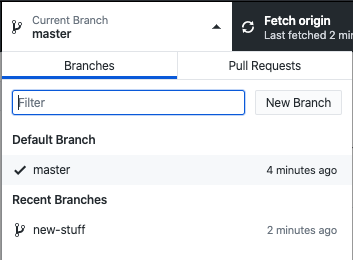
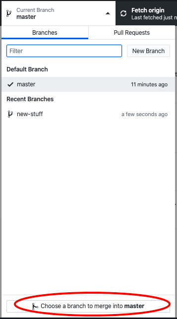
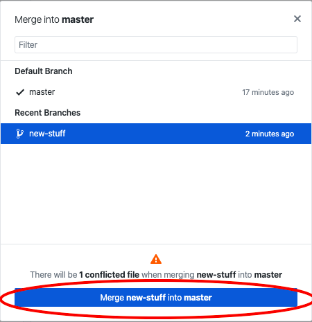
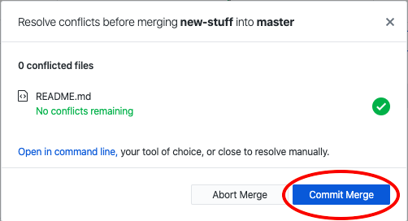
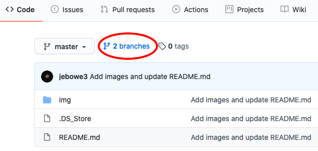
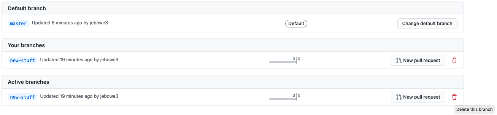
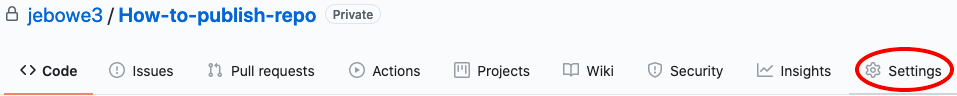
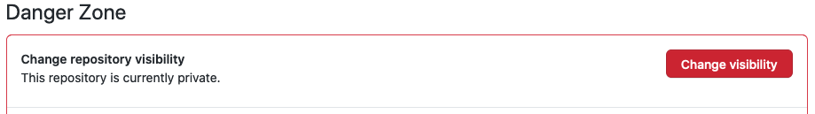

# How to publish your map project with a sharable link

Steps for publishing your repo and getting a sharable link for your map project

## Step 1: Merge your branch repo with the master (if your branch holds the final version)

If one of your branch repositories holds the final version of your map project, you will want to merge this branch into the master repository and delete any remaining branch repositories. This is merely a hygienic step to alleviate confusion when you return to your project at a later date. If you like things sloppy, you can always publish the branch!

The first step is to open GitHub Desktop. Select the master branch in the "Current Branch" tab.

  
**Figure 01.** Change branch to master with GitHub Desktop

Return to the "Current Branch" tab. At the bottom, you should see an option for "Choose a branch to merge into master." Click this and select the branch containing the final (or most up to date) version of your project.

  
**Figure 02.** Merge a branch into the master with GitHub Desktop

Now, press the button that says "Merge branch-name into master."

  
**Figure 03.** Make it happen

Open and resolve any conflicts in Atom and commit the merge.

  
**Figure 04.** Commit the merge

Now, get on the worldwide web and surf to your GitHub repository. Towards the top, you should be able to see a button that says "# branches." Click this.

  
**Figure 05.** Click on branches button

You will see a list of branches in your repository with some red trashcan icon to the right. Click on the trashcan next to the branch you want to delete. Be careful not to delete the master!

  
**Figure 06.** Deleting a branch

Now your repository is much cleaner and ready to publish.

## Step 2: Make your repository public

In your online repository, find and click the "Settings" option.

  
**Figure 07.** Select "Settings"

Scroll down to "Danger Zone."

  
**Figure 08.** Danger Zone

Once in the Danger Zone, find and click "Change visibility."

  
**Figure 09.** Change visibility
